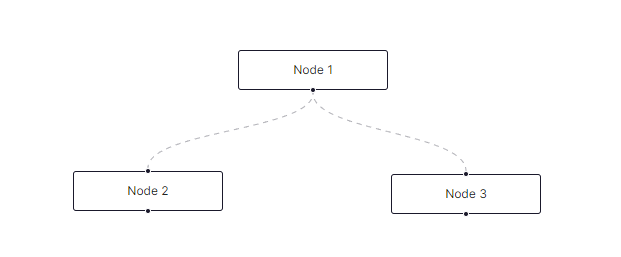

# React Flow

>  Very basic example of how to use **React Flow**.

```tsx title="/src/app/page.tsx"
import { Edge, Node, Position, ReactFlowProvider } from 'reactflow';

const nodeSize = {
    width: 100,
    height: 40,
};

const initialNodes: Node[] = [
    {
        id: '1',
        type: 'input',
        data: { label: 'Node 1' },
        position: { x: 250, y: 5 },
        size: nodeSize,
        handles: [
            {
                type: 'source',
                position: 'bottom' as Position,
                x: nodeSize.width * 0.5,
                y: nodeSize.height,
                width: 1,
                height: 1,
            },
        ],
    },
];

const initialEdges: Edge[] = [
    { id: 'e1-2', source: '1', target: '2', animated: true },
    { id: 'e1-3', source: '1', target: '3', animated: true },
];

async function fetchData(): Promise<{ nodes: Node[]; edges: Edge[] }> {
    return new Promise((resolve) => {
        setTimeout(() => {
            resolve({ nodes: initialNodes, edges: initialEdges });
        }, 1000);
    });
}

export default async function App() {
    const { nodes, edges } = await fetchData();

    return (
        <main className={styles.main}>
            <ReactFlowProvider initialNodes={nodes} initialEdges={edges}>
                <Flow nodes={nodes} edges={edges} />
            </ReactFlowProvider>
        </main>
    );
}
```

```tsx title="/src/components/Flow.tsx"
import 'reactflow/dist/style.css';

export default function App({
  nodes: initNodes,
  edges: initEdges,
}: {
  nodes: Node[];
  edges: Edge[];
}) {
  const [nodes, setNodes] = useState<Node[]>(initNodes);
  const [edges, setEdges] = useState<Edge[]>(initEdges);

  const onNodesChange: OnNodesChange = useCallback(
    (chs) => {
      setNodes((nds) => applyNodeChanges(chs, nds));
    },
    [setNodes]
  );

  const onEdgesChange: OnEdgesChange = useCallback(
    (chs) => {
      setEdges((eds) => applyEdgeChanges(chs, eds));
    },
    [setEdges]
  );

  const onConnect: OnConnect = useCallback(
    (params) => setEdges((eds) => addEdge(params, eds)),
    [setEdges]
  );

  return (
    <div style={{ width: '100vw', height: '100vh' }}>
      <ReactFlow
        nodes={nodes}
        edges={edges}
        onNodesChange={onNodesChange}
        onEdgesChange={onEdgesChange}
        onConnect={onConnect}
      />
    </div>
  );
}
```


